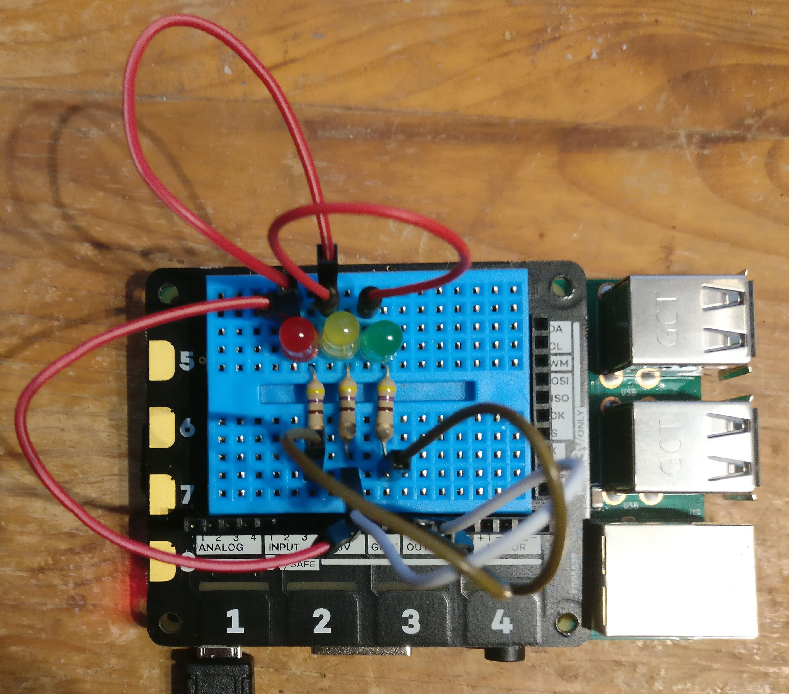
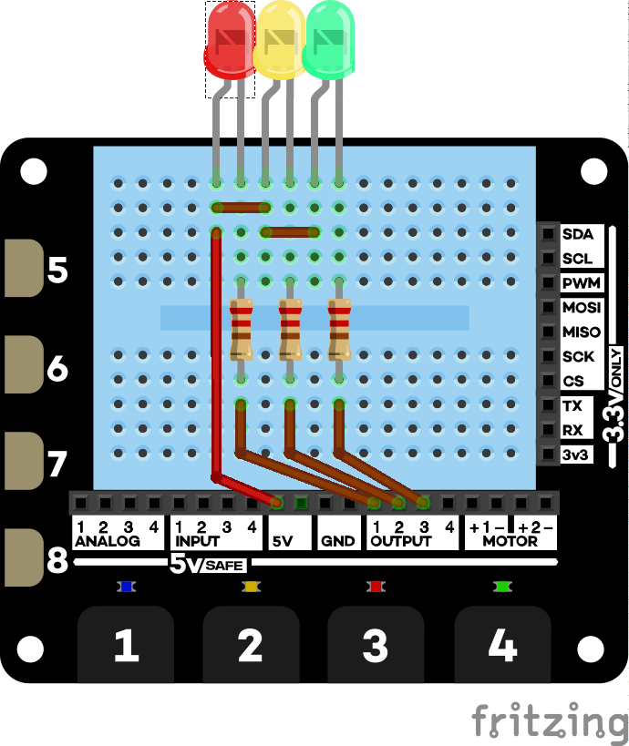
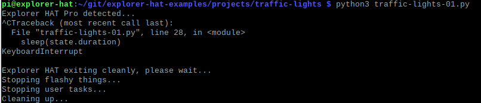

# Examples for *Explorer Hat Tricks*

**Disclaimer**: I have been a follower and customer of Pimoroni for years, but I have no official connection with them.

Please don't ask them for support in relation to this code!

## What this repository contains

These are projects from *Explorer Hat Tricks* - an ebook about the Pimoroni Explorer Hat Pro which you can buy on [Leanpub](https://leanpub.com/explorerhattricks/). That means you get a 40-day no-quibble **money back guarantee**).

### Wiring diagram

## What you will need

1. A [Raspberry Pi](https://www.raspberrypi.org/) model zero/zero W (with headers), B+, 2B, 3B, 3B+ or 4
running Raspbian buster.
1. A [Pimoroni Explorer HAT Pro](https://shop.pimoroni.com/products/explorer-hat). You can run some of the
projects with the original Explorer HAT or the Explorer pHAT.

1. The parts from a Pimoroni Explorer Hat Parts kit
1. Optionally, an LDR (Light dependent resistor)

### Time for a shameless plug :)

To get the most from these examples you should get *Explorer Hat Tricks* - an ebook about the Pimoroni Explorer Hat Pro which you can buy on [Leanpub](https://leanpub.com/explorerhattricks/).

I'll add wiring diagrams and README files to this repository as time permits.

## Installation

This code has been tested using python3.

1. Install Pimoroni's Explorer Hat Library using [these instructions](https://github.com/pimoroni/explorer-hat)
1. Clone this repository or download and unzip into a directory of your choice.

## Using the examples

1. Navigate to the example or project you want to run
1. Wire up the example. 
1. Run the relevant script. 

For instance, to run the traffic light project once you have wired it up, open a terminal window, 
change to the relevant directory and run `python3 traffic-lights-01.py`

Use `Ctrl-C` to quit the example.

The console should look like this:

## Index to examples

*A work in progress*.

All the examples are here, but not all have README files yet.

1. [On-board LEDs](projects/leds/README.md)
1. [Analogue Projects](projects/analog/README.md)

