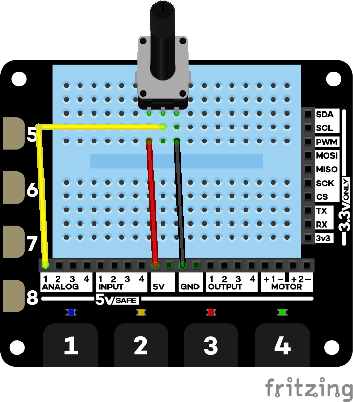
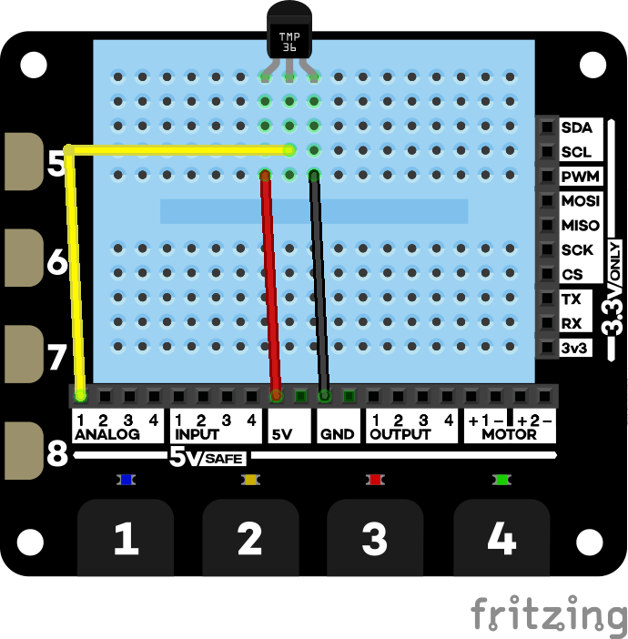
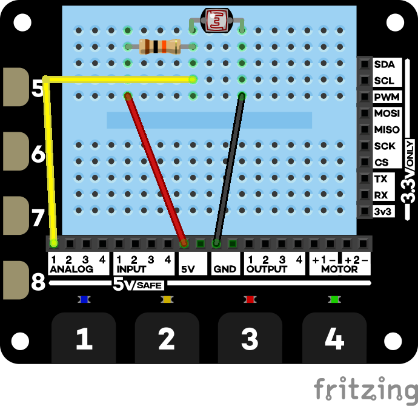

# Analog projects

These are projects from *Explorer Hat Tricks* - an ebook about the Pimoroni Explorer Hat Pro which you can buy on [Leanpub](https://leanpub.com/explorerhattricks/). That means you get a 40-day no-quibble **money back guarantee**).

## Potentiometer

Uses a potentiometer from the Pimoroni Explorer HAT Pro parts kit.

[code](potentiometer.py)

## TMP36 Temperature sensor

Uses a TMP36 sensor from the Pimoroni Explorer HAT Pro parts kit.

[code](TMP36.py)

## LDR

Uses an LDR (Light dependent resistor). You'll have to buy this separately as it isn;t in the Pimoroni kit.

[code](ldr.py)