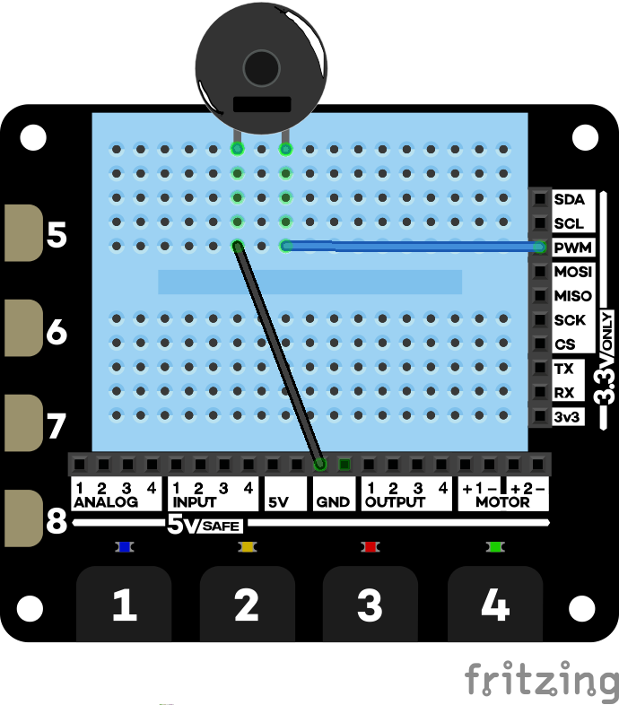

# Driving the buzzer

In this simple project you will wire up and drive a piezo buzzer.

This is a project from *Explorer Hat Tricks*, an ebook about the Pimoroni Explorer Hat Pro which you can buy on [Leanpub](https://leanpub.com/explorerhattricks/). That means you get a 40-day no-quibble **money back guarantee**).

## Wire it up

## Run the code

[code](buzzer.py)

When you touch pad 1 the buzzer will sound.

When you've tested it, exit the program by typing `Ctrl-c`