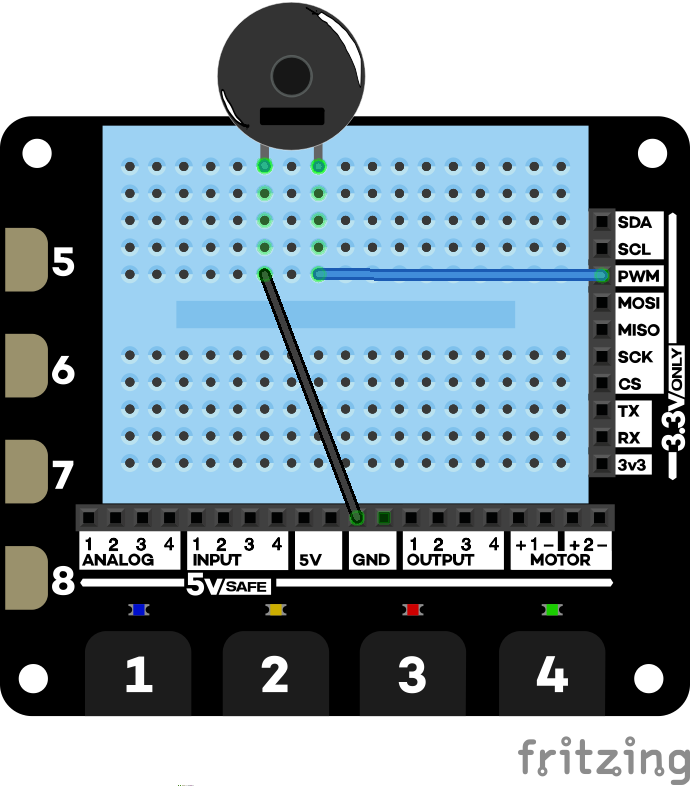

# Morse code senders

In these projects you will implement programs that will convert text into Morse code and the send it in flashes or buzzes.

These are projects from *Explorer Hat Tricks* - an ebook about the Pimoroni Explorer Hat Pro which you can buy on [Leanpub](https://leanpub.com/explorerhattricks/). That means you get a 40-day no-quibble **money back guarantee**).

Version 1 uses the on-board LEDs and needs no wiring-up.

Version 2 uses the buzzer.

## Morse Code project one

[code](morse-01.py)

## Morse code project two

This uses the same wiring as the introduction to the buzzer.

