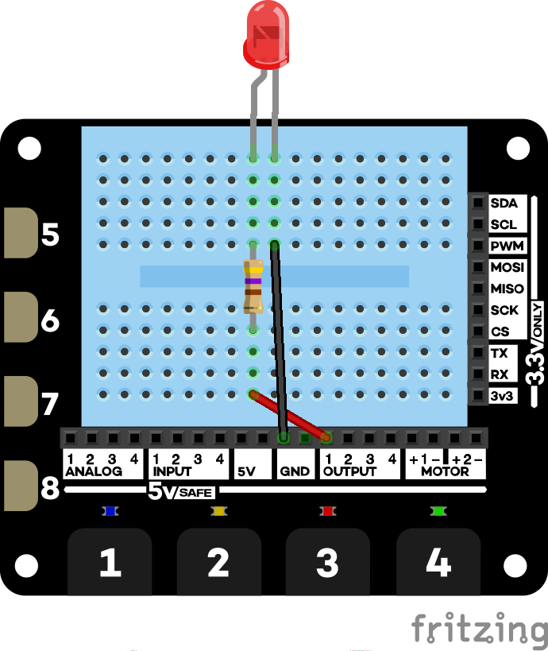

# Using outputs to drive external LEDs

Here is the wiring diagram:

The first program will blink the LED on and off. The second will control the LED via touch pad one.

[LED blink](external-led-blink.py)
[LED and touch](external-led-touch.py)