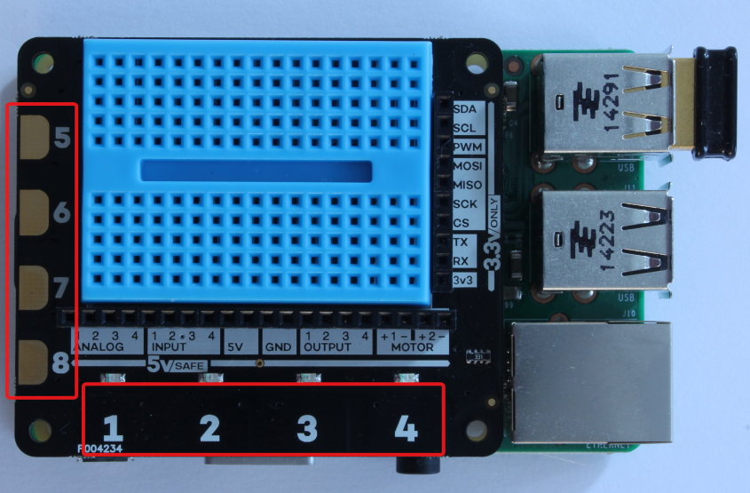

# Touch pads

In this simple project you will write code that uses the Explorer HAT's touch sensors.

These are projects from *Explorer Hat Tricks*, an ebook about the Pimoroni Explorer Hat Pro which you can buy on [Leanpub](https://leanpub.com/explorerhattricks/). That means you get a 40-day no-quibble **money back guarantee**).

No wiring is required.

The Explored HAT pro has eight touch pads, highlit in the image below.

The first two projects turn the on-board LED on or off as you touch pad number three.

[touch 1](led-touch-01.py)
[touch 2](led-touch-02.py)

The third and fourth projects turn LEDs 1-4 on as pads 1-4 are touched.

[touch 3](led-touch-03.py)
[touch 4](led-touch-04.py)
